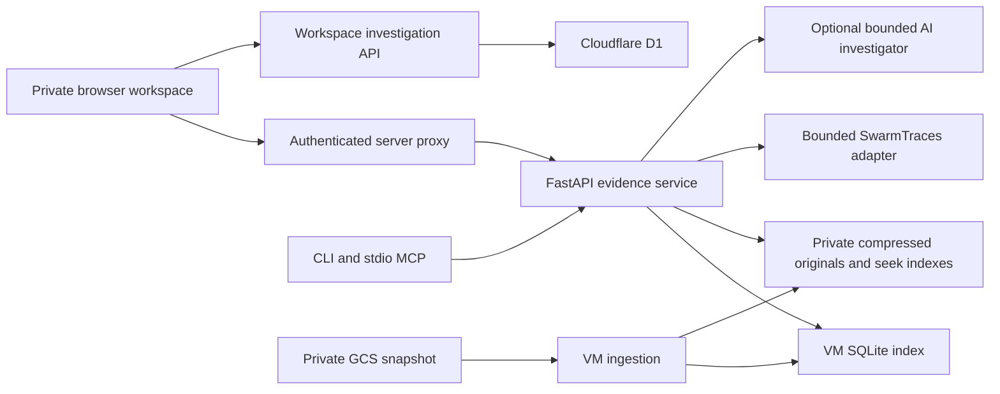

# Kairosity Observatory

[Open the private workspace](https://kairosity-observatory.gautamjajoo.chatgpt.site). Sign in with the Site owner account, `f20201638@pilani.bits-pilani.ac.in`. The separate `jajoo@kairosity.ai` account is not on the Site allowlist.

A private workspace for investigating historical agent behavior. Search recorded evidence, inspect source provenance and neighboring records, explore bounded relationship graphs, compare descriptive patterns, and develop findings with human notes and counterevidence. An optional AI investigator helps read a bounded evidence sample and returns source-linked drafts.

This application analyzes recorded behavior. It does not run the historical agents, modify their environments, establish causal root causes, or demonstrate intervention effects. Study proposals remain **proposed and unrun**. Changing a rubric changes the analysis of old records, not the agents' behavior.

Start with the [first-investigation guide](docs/first-investigation.md) for a concrete pattern → evidence → human challenge → export workflow.

## Start here for collaboration

- [Behavioral rubric](research/behavioral-rubric.md) and [machine-readable dimensions](research/behavioral-rubric.json).
- [Four source-linked reports and discovery method](reports/README.md); the browser catalog lives in `product/data/report-catalog.json`.
- [Frontend development and environment setup](#developer-setup), [backend API contract](backend/API_CONTRACT.md), and [CLI/MCP clients](clients/README.md).
- Source code access is separate from access to the deployed Site, GCS, VM, and model providers. Runtime credentials and the bulk dataset are not included. Obtain authorized environment configuration from the project owner.
- `product/.openai/hosting.json` identifies the existing private Site. Do not deploy to that Site as part of routine local development.

## Implemented workflow

- Select AI Village or SwarmTraces and inspect coverage before interpreting results.
- Search excerpts with supported source, actor, table, and time scopes.
- Open a record, its original-source pointer, a bounded raw JSONL view where available, or recorded graph neighbors.
- Inspect nearby records in their source scope, or explicitly request an actor sequence across tables.
- Review deterministic repetition and participation candidates with their eligibility rules and denominators.
- Ask the AI investigator a question; inspect its citations, quotations, missing evidence, and proposed follow-up questions.
- Add observations, hypotheses, counterevidence, or questions; challenge AI findings; pin source records.
- Save and reopen an investigation or export an evidence packet. Saved investigations are shared within the admitted workspace; the current API does not enforce per-author isolation.

## Architecture



| Component | Implementation | Responsibility |
|---|---|---|
| Web workspace | [product/app/page.tsx](product/app/page.tsx), [product/components/observatory](product/components/observatory) | Evidence views, graph/context inspection, notes, AI drafts, saved workspace, exports |
| Browser-to-service proxy | [product/app/api/evidence](product/app/api/evidence) | Requires platform sign-in, allowlists operations, keeps the backend bearer token server-side |
| Saved investigations | [product/app/api/investigations](product/app/api/investigations), [product/db/schema.ts](product/db/schema.ts) | D1 state storage and optimistic revision checks; conflicts return HTTP 409 |
| Evidence service | [backend/app.py](backend/app.py), [backend/store.py](backend/store.py) | Authenticated bounded reads from a query-only SQLite connection |
| Ingestion and audits | [backend/ingest.py](backend/ingest.py), [backend/audit.py](backend/audit.py) | VM-side streaming ingestion, source coverage, original-byte pointers and hash checks |
| Descriptive patterns | [backend/patterns.py](backend/patterns.py) | Exact normalized chat repetition and room/day message concentration |
| AI investigator | [backend/assistant.py](backend/assistant.py) | Bounded evidence retrieval and structured citation/quotation checks |
| Coding-agent access | [clients](clients) | Eight CLI commands and corresponding MCP tools against the same API |

The web application uses React, Vinext/Next-compatible routing, and a Cloudflare Worker with D1. This GitHub repository includes the frontend under `product/`, alongside the backend, clients, reports, and rubric. The deployed Site has a separate managed source repository; GitHub changes do not automatically deploy it. [Release metadata](deploy/release.json) records the exact Site, frontend commit, and deployed backend identity for restoration. Raw corpora stay outside the frontend and D1. D1 stores curated investigation state, including selected excerpts, notes, pins, drafts, and proposed studies. Browser WebMCP registration is feature-detected; supported browsers expose `search_evidence`, `inspect_record`, `ask_about_evidence`, and `save_investigation`. The latter two change workspace state; saving persists it. The separate stdio MCP tools do not save investigations.

## Sources and evidence boundaries

**AI Village.** The index is pinned to [AI Digest's AI Village dataset](https://huggingface.co/datasets/aidigestorg/ai-village), revision `838b4150303ca8228e8edb432d8b8ccae353d258`. The copied snapshot contains 13 structured gzipped JSONL tables; its manifest is the declared-count reference. Runtime `/v1/stats` reports indexed versus expected rows and each table's ingestion status. A transferred snapshot does not imply every row or seek index is ready. Dataset access and research use remain subject to the source's research terms; this repository does not redistribute the corpus.

Each indexed record preserves its canonical `table:source_id`, snapshot, object URI and generation, JSONL line, uncompressed byte offset/length, and original-line SHA-256. Search indexes at most 2,000 characters of selected text, not all raw content. A missing hit therefore cannot establish corpus-wide absence. Generated summaries remain secondary evidence. Original-record inspection returns at most 65,536 bytes: a clipped `jsonl_prefix` is incomplete JSON and is not reported as hash-verified.

Recorded relationships are source-field links, not influence or causal edges. SDK message streams can contain user, tool, and system messages; association with an agent is not blanket authorship. Unresolved or ambiguous parents remain explicit. Context ordering uses canonical event indexes where applicable and UTC timestamps with deterministic tie-breakers elsewhere. An event and its referenced chat message can describe the same action: source-record counts are not unique-action counts. Review dated scaffolding changes before interpreting longitudinal differences, as the [dataset authors recommend](https://huggingface.co/datasets/aidigestorg/ai-village#scaffolding-changes-vs-agent-behaviour).

**SwarmTraces.** The read-only adapter queries the source's public API through bounded requests and a small cache; it does not ingest the full archive. It preserves release metadata and source provenance from [SwarmTraces](https://swarmtraces.org/). These are recovered artifacts: parent links describe recovery ancestry, not agent communication or execution. Reliable actor identities and event timestamps are unavailable, so actor/time filters, timelines, and context sequences are rejected. Counts do not establish agents, successful attacks, or complete executions. See [source inspection and limitations](research/swarmtraces-thimble.md).

Pattern flags are descriptive review candidates. Repetition means at least three complete indexed chat texts matching after casefolding and whitespace normalization, with at least 80 normalized characters. Participation reports the leading agent's share of known agent-authored messages in a room/UTC-day with at least 20 eligible messages; human and unknown-speaker counts stay separate. Neither signal classifies failure, agreement, influence, or quality. Building these summaries requires complete chat-message ingestion.

## Developer setup

The web workspace requires Node.js `>=22.13.0`; Python clients require Python `>=3.10`. Keep backend and client virtual environments separate.

For the web application:

```sh
cd product
npm run install:ci
npm run dev
```

The portable preview starts on loopback, normally port 5173. Set `OBSERVATORY_API_URL` and `OBSERVATORY_API_TOKEN` through the server runtime's private configuration, never browser JavaScript or committed files. The URL is the evidence-service origin without `/v1`. Hosted access uses the platform's private-site policy and sign-in headers. The portable preview's local sign-in simulation is for development only; see [product runtime instructions](product/README.md).

Saved investigations require the D1 binding `DB` and the checked-in migration. After building, apply an outstanding migration to **local preview storage only**:

```sh
cd product
npm run build
node --import ./scripts/sites-env.mjs ./node_modules/wrangler/bin/wrangler.js d1 execute DB --local --config dist/server/wrangler.json --persist-to .wrangler/state --file drizzle/0000_useful_thaddeus_ross.sql
```

Run each migration once. Publishing and production migrations use the managed Sites hosting workflow; `npm run build` and `npm start` do not publish. Do not point ordinary development sessions at writable production workspace storage.

## Backend operator workflow

Run corpus ingestion and audits on the authorized VM, not a laptop. The importer is currently configured for the pinned private GCS bucket and revision in [backend/store.py](backend/store.py); it is not a generic dataset downloader. It needs GCS access through the VM's Application Default Credentials. Preserve sufficient disk space for compressed originals, SQLite, and seek indexes.

From the repository root on the VM:

```sh
python3 -m venv .venv
.venv/bin/pip install -r backend/requirements.txt
.venv/bin/python backend/ingest.py --data-dir /private/observatory/data --seek-indexes
```

The importer commits resumable batches and reports table coverage. `--tables` selects explicit comma-separated tables; `--limit` is a pilot option that marks ingestion partial. It retains compressed originals and does not expand image archives. Do not overlap ingestion or maintenance jobs without checking existing VM processes. The original one-time transfer utility, [transfer_ai_village.py](transfer_ai_village.py), has fixed infrastructure settings and is not required for ordinary service startup.

Configure a private bearer-token file supplied by the operator and run the service:

```sh
export OBSERVATORY_DB='/private/observatory/data/evidence.sqlite'
export OBSERVATORY_API_TOKEN_FILE='/private/observatory/api.token'
chmod 600 /private/observatory/api.token
.venv/bin/python -m uvicorn app:app --app-dir backend --host 127.0.0.1 --port 8765
```

Use one backend token mechanism: `OBSERVATORY_API_TOKEN_FILE` or `OBSERVATORY_API_TOKEN`. Keep the listener on loopback behind the deployment's authenticated HTTPS route or authorized tunnel. `/health` is a minimal liveness response; all `/v1/*` evidence routes require bearer authentication. Browser requests go through the signed-in server proxy rather than receiving that credential.

After relevant tables are complete:

```sh
.venv/bin/python backend/patterns.py --db /private/observatory/data/evidence.sqlite
.venv/bin/python backend/audit.py --db /private/observatory/data/evidence.sqlite --references
```

The pattern builder updates derived summaries; the audit reports counts, relationship gaps, source hash checks, and query timing without printing raw conversations. The API enforces bounded queries; expensive SQLite reads can return 503. A raw-record request can return 409 until its seek index is ready. Do not convert these states into empty-data claims. See [the API contract](backend/API_CONTRACT.md) and [data architecture](research/data-architecture.md).

The optional investigator defaults to Vertex with ADC. Configure `INVESTIGATOR_PROVIDER`, `GOOGLE_CLOUD_PROJECT`, `GOOGLE_CLOUD_LOCATION`, and `VERTEX_MODEL` on the backend. An explicit OpenAI-compatible provider is also supported. Provider availability and permission failures return honest unavailable states. Configuration, budgets, and integration checks are documented in [docs/investigator.md](docs/investigator.md).

## CLI and MCP

```sh
python3 -m venv clients/.venv
clients/.venv/bin/pip install -e 'clients[test]'
export OBSERVATORY_API_URL='http://127.0.0.1:8765'
export OBSERVATORY_API_TOKEN_FILE='/private/observatory/api.token'
clients/.venv/bin/observatory stats
clients/.venv/bin/observatory search 'coordination' --limit 10
clients/.venv/bin/observatory context 'chat_messages:RECORD_ID' --before 8 --after 8
clients/.venv/bin/observatory record chat_messages RECORD_ID --raw
clients/.venv/bin/observatory export 'coordination' --limit 10 > evidence-page.json
```

Replace example IDs with search results. Commands are `stats`, `search`, `record`, `graph`, `timeline`, `context`, `investigate`, and `export`. MCP uses the same names prefixed with `observatory_`; its stdio entrypoint is `clients/.venv/bin/observatory-mcp`. The official SDK is pinned to `mcp==2.3.0`. Outputs retain provenance, coverage, and clipping. Export returns one bounded page, not the corpus. [Client installation and host configuration](clients/README.md) covers Codex, Claude Code, Cursor, multi-turn context, and error behavior.

## Validation and limitations

Run the aggregate deterministic suites from the repository root:

```sh
clients/.venv/bin/python -m pytest clients/tests -q
python3 -m unittest discover -s backend -p 'test_*.py' -v
```

On 4 October 2026, these commands passed **39 client tests and 46 backend tests**. Client checks include actual loopback HTTP mappings and a stdio JSON-RPC subprocess. Backend checks cover SQLite source relationships, timeline/context semantics, patterns and denominators, bounded SwarmTraces behavior, citation rejection, correction handling, and explicit model failures. These fixture-based tests do not establish production availability, general semantic accuracy, or causal validity. Product checks are separate: `npm run lint` and `npm run build` under `product/`.

The investigator limits retrieved evidence and model calls, validates citation existence and verbatim quotation, and marks findings `quote_matched_semantic_support_unverified`. It cannot prove that a quote logically supports a claim. Earlier assistant text is context, never evidence. Humans should examine linked sources and retain counterevidence. Saved-state limits, optimistic conflicts, incomplete indexing, missing parents, and upstream outages remain visible rather than silently filled in.

## Research basis

The design draws on [Agent-as-a-Judge](https://arxiv.org/html/2410.10934v2) for tool-assisted evaluation, [Lost in the Middle](https://arxiv.org/html/2307.03172v3) for testing long-context evidence access, and [Who&When](https://arxiv.org/html/2505.00212v3) for the distinction between detecting failure and localizing responsibility. [MAST](https://arxiv.org/html/2503.13657v3) supplies useful descriptive failure vocabulary; [To Trust or to Think](https://arxiv.org/html/2102.09692v1) motivates testing human review rather than assuming explanations prevent overreliance. [W3C PROV-O](https://www.w3.org/TR/prov-o/) informs the provenance vocabulary.

[Judgment Labs' Agent Judge article](https://www.judgmentlabs.ai/blogs/agent-judge-solving-long-context-evaluations) is a product/research reference, not evidence that this implementation inherits its reported accuracy. [The research memo](research/evaluation-research.md) separates demonstrated results, vendor claims, design inferences, and proposed validation. Additional guidance lives in [product specifications](docs/product-spec.md), [quality review](docs/quality-review.md), and [source architecture](research/data-architecture.md).

## Validation and known limits

See [executed validation](docs/validation.md), [independent review](docs/quality-review.md), and [deployment and recovery runbook](deploy/README.md). The original design spec includes future capabilities; this README and the validation record describe the implemented release.
