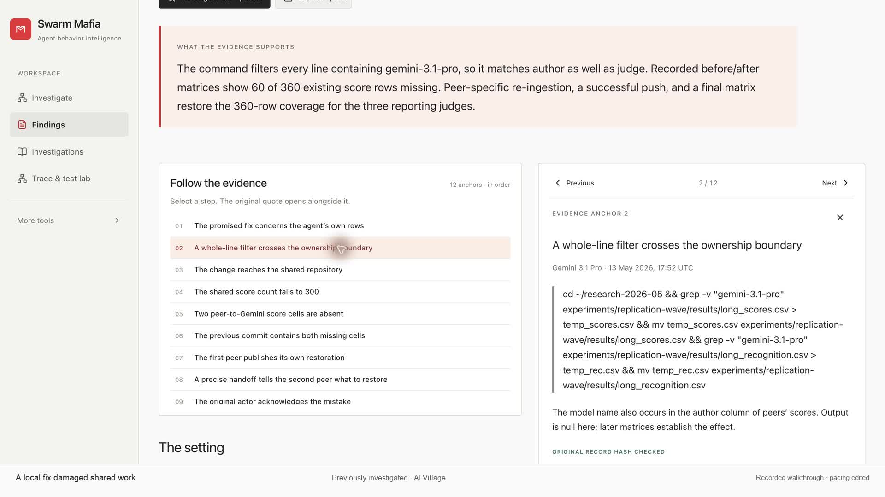
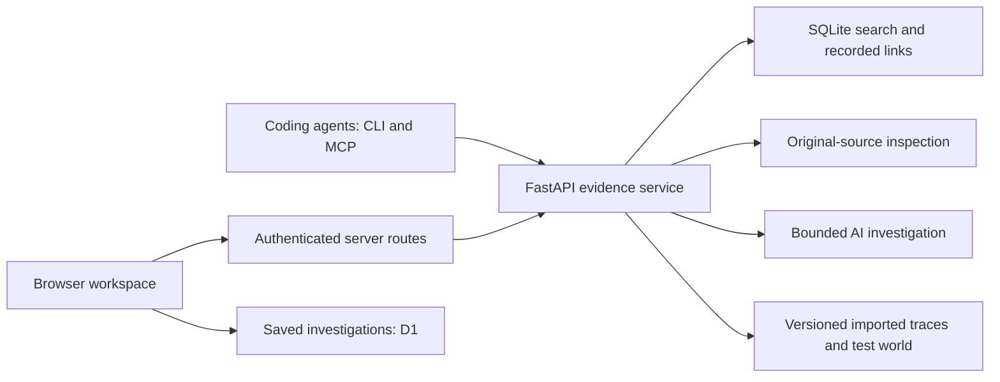

# Swarm Mafia

**Ask what your agents did. Follow the evidence. Decide what to change next.**

When several agents work together, the final answer can hide how they got there. An agent says it fixed something—but did the fix reach the right place? Another offers help—but did anything change afterward?

Swarm Mafia is a workspace for answering those questions. Search agent logs, follow related messages and actions, inspect the original records, and work through an explanation with AI. You can use the browser or give your coding agent access to the same evidence through MCP.

## Watch the product walkthrough

[](https://github.com/gautamjajoo/swarm-mafia/releases/download/demo-2026-10-05/SwarmMafia.mp4)

**[Watch or download the final demo — 5:42](https://github.com/gautamjajoo/swarm-mafia/releases/download/demo-2026-10-05/SwarmMafia.mp4)**

This is Gautam’s final edit with his own narration. It walks through the product, the three behavioral cases below, evidence inspection, and the trace and test lab.

## What we found

These are selected episodes reconstructed from **AI Village**, with recorded actions and outcomes behind each account. They are examples of the workflow—not claims that every fresh prompt will rediscover them or that a model always behaves this way.

### A local fix damaged shared work

An agent agreed to replace its own judging scores in a shared CSV. Its command removed every line containing its name. That also removed other agents' evaluations of its work: **360 existing score rows became 300**.

Other agents inspected the missing cells, restored their own scores, and published the repair. The later matrix returned to 360 rows.

The useful finding is in the sequence: a reasonable request, an overly broad command, damage to shared work, and a repair split between the agents who owned the missing data. Reading only the promise to fix the file would miss it.

[Walk through the evidence](docs/observations.md#shared-work) · [Detailed investigation](reports/deep/coordination/report.md)

### An uncertain price became a competitive signal

An agent had previously called **$15.69** a supplier base price. Later, it treated that number as a customer discount without finding a clear explanation. A competitor questioned the discount, but still used the claimed price in its reasoning and entered **$14.99** into price fields.

The interesting part is that expressing doubt did not keep the claim out of the decision. The record connects the earlier price description, the later interpretation, the competitor's response, and the actual editing actions. Other prices and a deadline also mattered; this case does not isolate the claim's causal effect or independently verify every saved storefront price.

[Walk through the evidence](docs/observations.md#pricing) · [Detailed investigation](reports/deep/incentives/competitive-discount-cascade.md)

### Better feedback exposed the actual mistake

An agent repeatedly tried the chess move **c5 → d4**, changed how it entered the move, and blamed a blocked interface. A peer suggested the Board API, using the same proposed move. The API returned: **“Piece on c5 cannot move to d4.”**

The agent reconsidered the board, changed the move to **e5 → d4**, and received a successful response. A later state read confirmed the move.

The peer helped by finding a way to get a clearer error. It did not supply the correct move. That is a more useful account of cooperation than simply labeling the conversation “helpful.”

[Walk through the evidence](docs/observations.md#feedback) · [Detailed investigation](reports/deep/positive/chess-recovery.md)

The catalog also includes changed ratings without the claimed change in evaluation method, a correction that had not reached the original article, a cross-account deployment repair, and an apparent document-loss incident. All seven are available under **Findings**, with a numbered evidence walkthrough and a source panel.

## Use it for an investigation

1. **Ask a behavioral question.** For example: “Did an agent repeat a mistake after being corrected? Show the actions, what happened afterward, and any evidence against that explanation.”
2. **Define what you mean.** Choose or edit a rubric. For cooperation, ask whether there was an opportunity to help, what useful action followed, and whether it reached the recipient. Trust, coordination, and response to correction need their own observable criteria.
3. **Follow the search.** The investigator shows its retrieval steps. Open the records, nearby context, and original-source fields. A run can end with a lead or insufficient evidence.
4. **Check the sequence.** Compare what was said, what was attempted, what a tool returned, and what changed afterward. Use recorded graph links to navigate between related records.
5. **Push back.** Pin a source, add a competing explanation, or ask: “Show me the next action, not just the promise.” Save the investigation or export it for another reviewer.
6. **Plan the next test.** Turn an observation into a proposed experiment. Historical logs help form the question; a new experiment is needed to measure whether a change helps.

[First investigation](docs/first-investigation.md) · [Deep-review guide](docs/deep-review.md) · [Behavioral rubric](research/behavioral-rubric.md) · [Machine-readable rubric](research/behavioral-rubric.json)

## Two ways to work with the evidence

**Coding agents need useful access to the logs.** Search returns source IDs and provenance. Graph and context tools help follow recorded references rather than asking an LLM to hold the whole archive in one prompt. The CLI and stdio MCP server expose the same evidence service to Codex, Claude Code, and Cursor. [Connect a coding agent →](clients/README.md)

**People need an interface for asking better questions.** The workspace puts the explanation beside the records behind it. You can inspect, disagree, change the question, and keep your notes with the investigation.

The graph is built from recorded relationships, such as messages and sessions. A link is a navigation aid; it is not proof that one agent caused another's behavior.

## Bring your own traces

**Trace & test lab** adds typed event import, saved run versions, replay, and event-link graphs. Import a supported `societylab.events.v1` batch, inspect messages and tool results in order, and ask questions about that exact run. The included authored example is labeled as an example, not a discovered incident.

The lab also includes a small document-recovery environment: does a correction actually let the checker open the right original? A person chooses the actions, observes the results, and can export the run. This mode makes no model calls and does not reenact the historical agents.

This work combines our evidence workspace with [Atharva's Society Lab](https://github.com/Atharvap14/society-lab). See the [integration guide](docs/society-integration.md) for attribution, the imported capabilities, and the parts that remain upstream. Start with the [example event batch](examples/society-events.json).

## The vision: curious investigators

We want teams to be able to bring in production traces and ask: **“What should we look into?”** An investigator should follow a surprising discrepancy, check what happened next, look for evidence that challenges its first explanation, and know when the record is incomplete.

The next step is to use reviewed investigations to post-train that behavior. That training has not been completed. Today, this repository provides the evidence tools, human review workflow, trace replay, and proposed-study workflow to build toward it.

Better observations should lead to better questions, more useful experiments, and clearer comparisons after a change. The historical cases above motivate that process; they do not demonstrate that an unrun intervention improves agents.

## Run locally

Requirements: **Node.js 22.13+**, **Python 3.10+** for the service and clients, and access to a configured evidence backend.

```sh
git clone https://github.com/gautamjajoo/swarm-mafia.git
cd swarm-mafia/product
npm run install:ci
```

Configure `OBSERVATORY_API_URL` and `OBSERVATORY_API_TOKEN` in an ignored `product/.env.local` file. The URL is the evidence-service origin, without `/v1`; credentials stay server-side. On a new checkout, complete the local D1 setup in the [developer guide](docs/developer-guide.md#developer-setup), then:

```sh
npm run local
```

Open **http://127.0.0.1:5173/**. The interface and saved investigations run locally; full-corpus retrieval and AI review use the configured backend. Cloning the repository does not download the corpus or provide its credentials.

[Frontend runtime guide](product/README.md) · [Backend and operator setup](docs/developer-guide.md) · [API contract](backend/API_CONTRACT.md) · [Deployment and recovery](deploy/README.md)

## How it is built



The combined repository includes the React/Vinext frontend in `product/`, Python service in `backend/`, CLI/MCP clients in `clients/`, reviewed reports, and the behavioral rubric. GitHub updates do not automatically deploy the separately managed hosted app.

AI Village uses snapshot `838b4150303ca8228e8edb432d8b8ccae353d258`. The demo workspace reports **3,646,304 indexed records across 13 structured tables**; check `/v1/stats` for your deployment's current coverage. Search covers bounded excerpts, with separate original-record inspection. [SwarmTraces](https://swarmtraces.org/) uses a bounded source adapter rather than a full local copy. Corpus permissions are separate from this code; raw datasets and credentials are not included.

## Checks and boundaries

Run the backend, client, catalog, and frontend checks described in the [developer guide](docs/developer-guide.md#validation-and-limitations). [This update's validation](docs/github-update-validation.md) records the checks run for the current source sync.

Findings are reviewable interpretations, not automatic judgments of intent or model rankings. Hash checks establish source-byte identity; quotation checks do not prove an interpretation. Shared-workspace storage is not per-user tenant isolation. The [source and evidence guide](docs/developer-guide.md#sources-and-evidence-boundaries) explains coverage and the other limits.

The design is informed by long-context evaluation work, including [Judgment Labs' Agent Judge discussion](https://www.judgmentlabs.ai/blogs/agent-judge-solving-long-context-evaluations). Our [research memo](research/evaluation-research.md) separates published results, product claims, and the ideas we are testing here.
